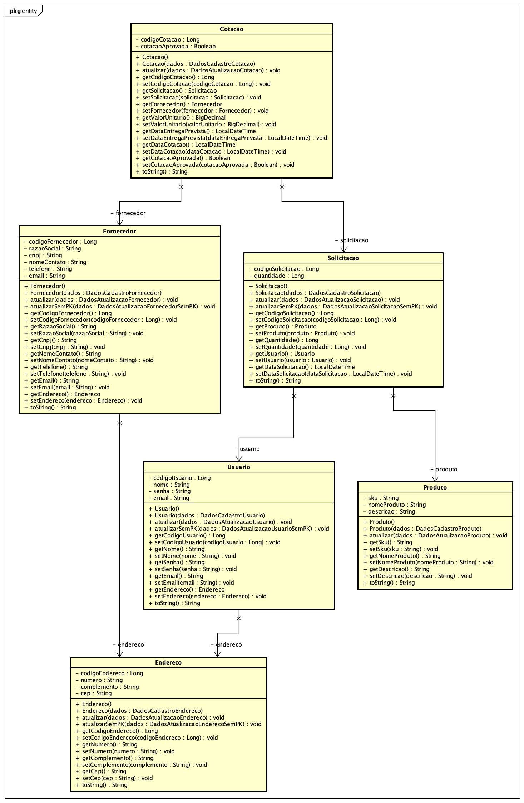
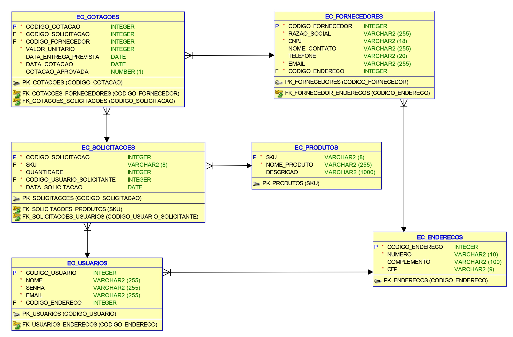
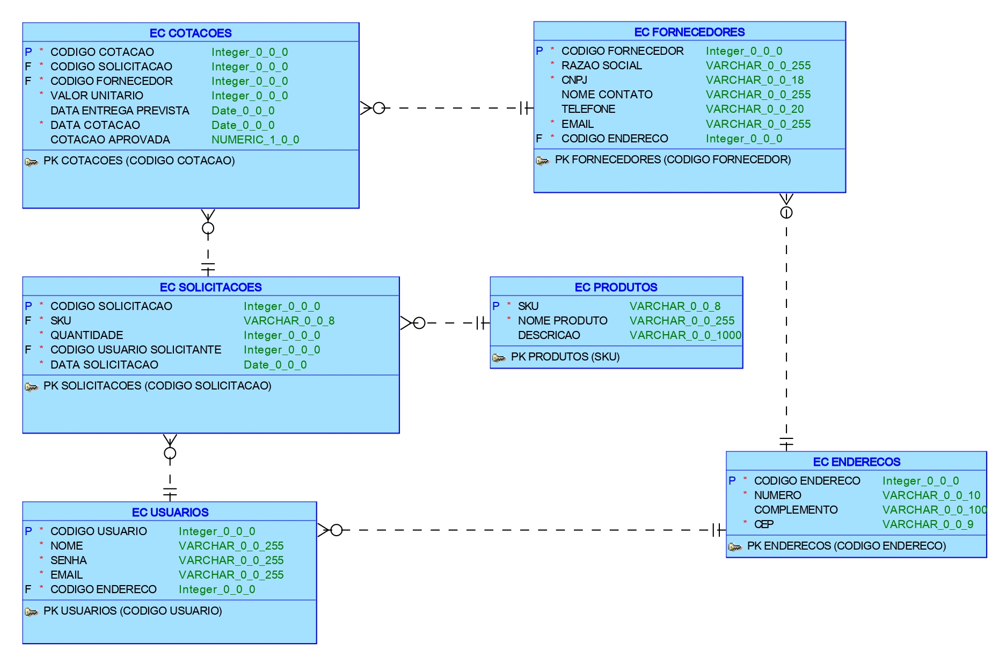

# <font color="orange">**CHALLENGE FIAP 2023**</font>
<br>

 

<br>

## <font color="orange">**Integrantes do Projeto**</font> 
- RM96685 - BRUNO BARBOSA BRAGA DOS SANTOS - [GitHub](https://github.com/Dannzini)
- RM97012 - IGOR AUGUSTO TAKESHIGUE LEMOS - [GitHub](https://github.com/igoorlemoos)
- RM97192 - JOEDERSON OLIVEIRA PEREIRA - [GitHub](https://github.com/JoePereira)
- RM96950 - MARIO ITO BOCCHINI - [GitHub](https://github.com/mario-ito)

<br>

## <font color="orange">**COMO RODAR A APLICAÇÃO**</font> 
### Configurar o Arquivo de Configuração

- Abra o projeto no seu IDE (por exemplo, Eclipse, IntelliJ) e navegue até a pasta `src/main/resources`.
- Localize o arquivo `application.properties` e abra-o.
- Dentro do arquivo, você encontrará propriedades relacionadas ao banco de dados. Geralmente, as propriedades são semelhantes a isso:
   ```properties
   spring.datasource.url=jdbc:mysql://localhost:3306/meubanco
   spring.datasource.username=seuUsuario
   spring.datasource.password=suaSenha
- Altere as informações do banco de dados de acordo com as configurações do seu banco de dados. Substitua seuUsuario, suaSenha e jdbc:mysql://localhost:3306/meubanco pelo seu nome de usuário, senha e URL do banco de dados. Depois salve o arquivo.

<br>

### Executar e Testar a Aplicação
- Abra a classe `ApiEasyComprasApplication` que está localizada em `src/main/java/br.com.easycompras.api_easycompras`.
- Dentro dessa classe, você encontrará o método main. Clique com o botão direito do mouse sobre esse método e selecione "Run" para executar a aplicação Spring Boot.

- A aplicação agora deverá iniciar. Ela irá se conectar ao banco de dados usando as informações configuradas no `application.properties`. Durante a inicialização, o Spring Boot automaticamente executará scripts SQL para criar as tabelas no banco de dados


<br>

## <font color="orange">**Endpoints API**</font>

### **Endereço**

<b>Descrição dos endpoints de Endereço</b>

- `POST` /endereco: cadastrar um novo Endereço
- `GET` /endereco: listar todos os Endereços
- `GET` /endereco/{id}: retornar um Endereço pelo seu id (codigoEndereco)
- `PUT` /endereco/{id}: atualizar um Endereço pelo seu id (codigoEndereco)
- `DELETE` /endereco/{id}: apagar um Endereço pelo seu id (codigoEndereco)

<br>

### **Usuario**

<b>Descrição dos endpoints de Usuario:</b>

- `POST` /usuario: cadastrar um novo Usuario
- `GET` /usuario: listar todos os Usuarios
- `GET` /usuario/{id}: retornar um Usuario pelo seu id (codigoUsuario)
- `PUT` /usuario/{id}: atualizar um Usuario pelo seu id (codigoUsuario)
- `DELETE` /usuario/{id}: apagar um Usuario pelo seu id (codigoUsuario)

<br>

### **Produto**

<b>Descrição dos endpoints de Produto:</b>

- `POST` /produto: cadastrar um novo Produto
- `GET` /produto: listar todos os Produtos
- `GET` /produto/{id}: retornar um Produto pelo seu id (sku)
- `PUT` /produto/{id}: atualizar um Produto pelo seu id (sku)
- `DELETE` /produto/{id}: apagar um Produto pelo seu id (sku)

<br>

### **Fornecedor**

<b>Descrição dos endpoints de Fornecedor:</b>

- `POST` /fornecedor: cadastrar um novo Fornecedor
- `GET` /fornecedor: listar todos os Fornecedores
- `GET` /fornecedor/{id}: retornar um Fornecedor pelo seu id (codigoFornecedor)
- `PUT` /fornecedor/{id}: atualizar um Fornecedor pelo seu id (codigoFornecedor)
- `DELETE` /fornecedor/{id}: apagar um Fornecedor pelo seu id (codigoFornecedor)

<br>

### **Solicitação**

<b>Descrição dos endpoints de Solicitação:</b>

- `POST` /solicitacao: cadastrar uma nova Solicitação
- `GET` /solicitacao: listar todas as Solicitações
- `GET` /solicitacao/{id}: retornar uma Solicitação pelo seu id (codigoSolicitacao)
- `PUT` /solicitacao/{id}: atualizar uma Solicitação pelo seu id (codigoSolicitacao)
- `DELETE` /solicitacao/{id}: apagar uma Solicitação pelo seu id (codigoSolicitacao)

<br>

### **Cotação**

<b>Descrição dos endpoints de Cotação:</b>

- `POST` /cotacao: cadastrar uma nova Cotação
- `GET` /cotacao: listar todas as Cotações
- `GET` /cotacao/{id}: retornar uma Cotação pelo seu id (codigoCotacao)
- `PUT` /cotacao/{id}: atualizar uma Cotação pelo seu id (codigoCotacao)
- `DELETE` /cotacao/{id}: apagar uma Cotação pelo seu id (codigoCotacao)

<br>

## <font color="orange">**DIAGRAMAS**</font>

### DIAGRAMA DE CLASSES 


### MODELO RELACIONAL


### MODELO LÓGICO


<br>

## <font color="orange">**PITCH EASY COMPRAS**</font>

[](https://youtu.be/8JHqWVqeH18)

