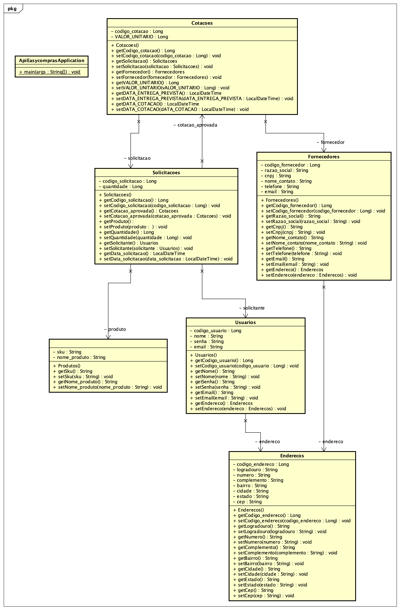
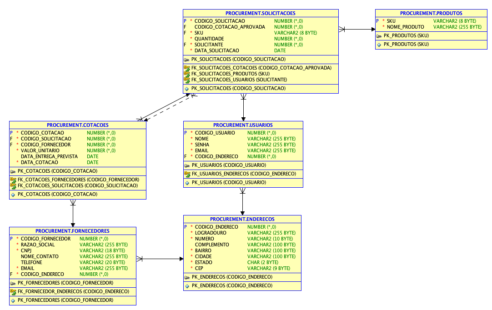
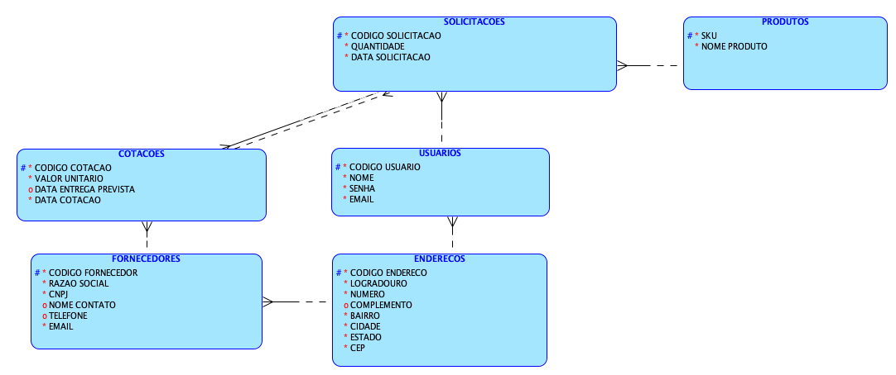

# CHALLENGE 2023  - EASY COMPRAS


## Integrantes do Projeto
- RM96685 - BRUNO BARBOSA BRAGA DOS SANTOS (RESPONSÁVEL PELO PROJETO)
- RM96950 - MARIO ITO BOCCHINI
- RM97012 - IGOR AUGUSTO TAKESHIGUE LEMOS
- RM97192 - JOEDERSON OLIVEIRA PEREIRA

# COMO RODAR A APLICAÇÃO
## Configurar o Arquivo de Configuração

- Abra o projeto no seu IDE (por exemplo, Eclipse, IntelliJ ou Visual Studio Code) e navegue até a pasta `src/main/resources`.
- Localize o arquivo `application.properties` e abra-o.
- Dentro do arquivo, você encontrará propriedades relacionadas ao banco de dados. Geralmente, as propriedades são semelhantes a isso:
   ```properties
   spring.datasource.url=jdbc:mysql://localhost:3306/meubanco
   spring.datasource.username=seuUsuario
   spring.datasource.password=suaSenha
- Altere as informações do banco de dados de acordo com as configurações do seu banco de dados. Substitua seuUsuario, suaSenha e jdbc:mysql://localhost:3306/meubanco pelo seu nome de usuário, senha e URL do banco de dados. Depois salve o arquivo.

## Executar e Testar a Aplicação
- Abra a classe ApiEasyComprasApplication que está localizada em src/main/java/br.com.easycompras.api_easycompras.
- Dentro dessa classe, você encontrará o método main. Clique com o botão direito do mouse sobre esse método e selecione "Run" para executar a aplicação Spring Boot.

- A aplicação agora deverá iniciar. Ela irá se conectar ao banco de dados usando as informações configuradas no application.properties. Durante a inicialização, o Spring Boot automaticamente executará scripts SQL para criar as tabelas no banco de dados


# DIAGRAMA DE CLASSES

#### DIAGRAMA DE UML 


#### MODELO RELACIONAL


#### MODELO LÓGICO


## PITCH EASY COMPRAS
- https://youtu.be/8JHqWVqeH18
  


