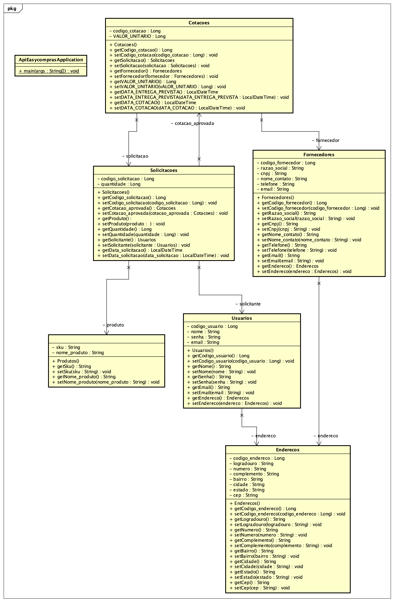
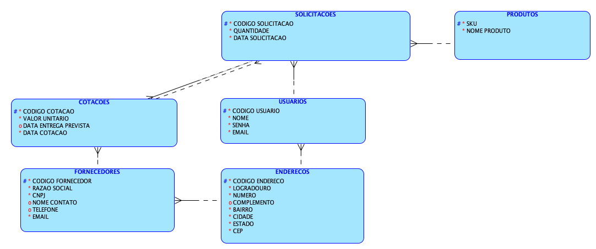

# CHALLENGE 2023  - EASY COMPRAS

## Integrantes do Projeto
- RM96685 - BRUNO BARBOSA BRAGA DOS SANTOS (RESPONSÁVEL PELO PROJETO)
- RM96950 - MARIO ITO BOCCHINI
- RM97012 - IGOR AUGUSTO TAKESHIGUE LEMOS
- RM97192 - JOEDERSON OLIVEIRA PEREIRA

# COMO RODAR A APLICAÇÃO

# DIAGRAMA DE CLASSES

### DIAGRAMA DE UML 

### MODELO MER

